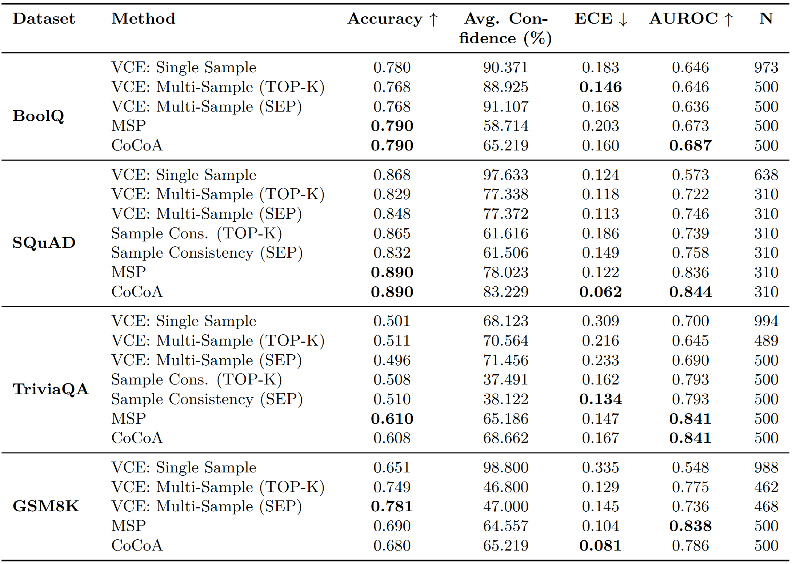
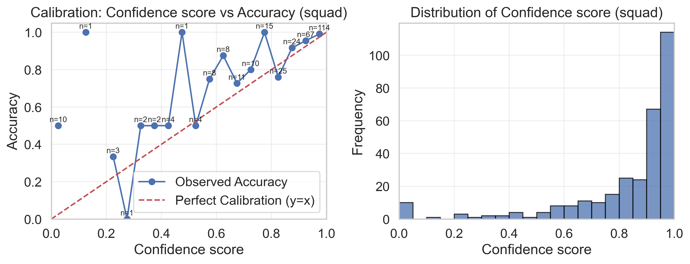
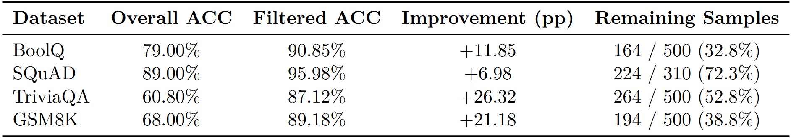
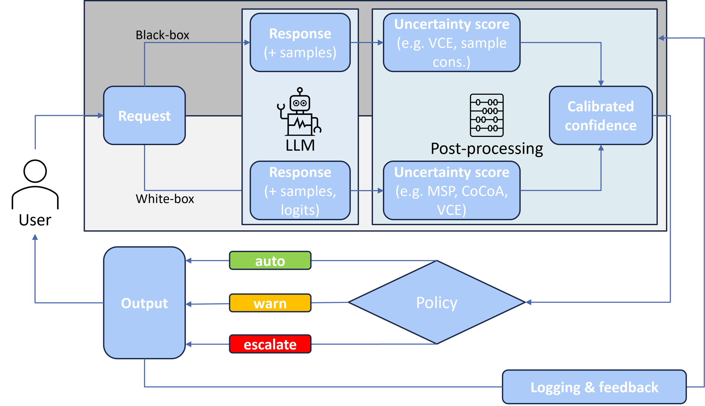

# Evaluating and Reducing Uncertainty in LLM Outputs

This repository contains the official implementation of the project *Evaluating and Reducing Uncertainty in LLM Outputs to Improve Performance and Reliability for Insurance Applications*.  

We benchmark multiple uncertainty estimation methods for Large Language Models (LLMs) across diverse QA datasets (BoolQ, SQuAD 2.0, TriviaQA, GSM8K).  
The study covers **verbalized confidence elicitation (VCE)**, **maximum sequence probability (MSP)**, **sample-consistency metrics**, and our proposed **CoCoA (Confidence–Consistency Aggregation)**.  

---

## Requirements

To install all required dependencies:

```
pip install -r requirements.txt
```
Python 3.10+ and CUDA-enabled GPUs are recommended for efficient multi-sample decoding.

---

## Project Structure

```
.
├── figures/ # Saved plots (calibration, temp sweeps, comparisons)
├── output/ # Experimental outputs for different uncertainty metrics
├── scripts/ # Main experiment scripts
│ ├── llm_confidence_elicitation_batch.py # Single-sample VCE
│ ├── llm_confidence_elicitation_sample_batch.py # Multi-sample VCE
│ ├── llm_confidence_elicitation_parse_outputs.py
│ ├── llm_polygraph_uncertainty_runner.py # MSP and CoCoA
│ └── llm_sampling_consistency.py # Consistency-based metrics
├── tables/ # Exported evaluation tables
├── notebooks/ # Analysis and visualization notebooks
├── analyze_confidence_output.ipynb # Analysis of VCE results
├── analyze_polygraph_output.ipynb # Analysis of MSP/CoCoA results
├── analyze_sampling_consistency.ipynb # Analysis of sampling consistency results
├── dataset_analysis.ipynb # Dataset analysis
├── llm_model_wrappers.py 
├── parsing_and_evaluation.py
├── README.md
└── requirements.txt
```

---

## Running Experiments

The respective scripts are located in `scripts/` and can be run directly as `.py` files.  
Parameters (dataset, decoding mode, number of samples) are configured inside each script.

Examples:

- **Single-Sample VCE**  
```bash
python scripts/llm_confidence_elicitation_batch.py
```

- **Multi-Sample VCE**

```bash
python scripts/llm_confidence_elicitation_sample_batch.py
```


- **MSP / CoCoA**  

```bash
python scripts/llm_polygraph_uncertainty_runner.py
```

Outputs are stored in `output/` and plots in `figures/`.


---

## Evaluation

We evaluate across four datasets using **Accuracy (ACC)**, **Expected Calibration Error (ECE)**, **AUROC**, and **average confidence**.

Below is the unified evaluation table:

<p align="center">  </p>

--- 

## Results

- Multi-sample VCE improves calibration (ECE) across tasks, especially on GSM8K.

- MSP (probability-based) is a strong, resource-efficient baseline, particularly competitive on TriviaQA and GSM8K.

- Sample-consistency helps in open-domain QA but is less robust overall.

- CoCoA achieves the best calibration (ECE) on SQuAD and GSM8K, and competitive AUROC across all datasets by combining model belief with semantic agreement.

Example calibration plot (SQuAD with CoCoA):

<p align="center">  </p>

## Selective Prediction with CoCoA

By filtering predictions at high confidence ($C^\star > 0.8$), accuracy improves substantially across datasets:

<p align="center">  </p>

This demonstrates that CoCoA is well-suited for risk-sensitive applications where abstention is preferable to wrong answers.


---

## Practical Recommendations

- ✅ Multi-sample VCE (SEP or TOP-K) reduces overconfidence and improves calibration.

- ✅ MSP is a strong, low-cost uncertainty metric when computational resources are limited.

- ✅ CoCoA provides the most reliable overall performance when budget allows multiple samples.

- ⚖️ Temperature tuning can modestly improve ranking but is task-dependent.

- 🚨 Always calibrate scores post-hoc; raw self-reported confidence is unreliable.

## Deployment pipeline

A possible integration of uncertainty-aware LLMs into decision workflows is illustrated below.
Depending on confidence, predictions can be used automatically, flagged for review, or escalated:

<p align="center">  </p>

---

## Team

Project Team: Christian Hobelsberger (LMU, Munich Re) & Theresa Winner (LMU)  
Project Partners: Dr. Andreas Nawroth & Oliver Mitevski (Munich Re)  
Project Supervisor: Dr. Anna-Carolina Haensch (LMU)

---

## Final Report

The full scientific report can be requested from the authors.